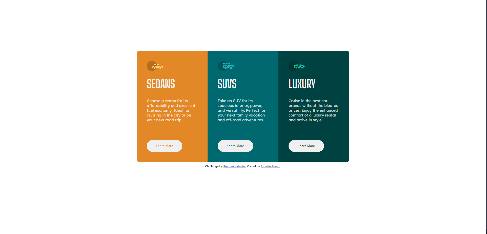

# Frontend Mentor - 3-column preview card component solution

This is a solution to the [3-column preview card component challenge on Frontend Mentor](https://www.frontendmentor.io/challenges/3column-preview-card-component-pH92eAR2-). Frontend Mentor challenges help you improve your coding skills by building realistic projects. 

## Table of contents

- [Overview](#overview)
  - [The challenge](#the-challenge)
  - [Screenshot](#screenshot)
  - [Links](#links)
- [My process](#my-process)
  - [Built with](#built-with)
- [Author](#author)
- [Acknowledgments](#acknowledgments)

## Overview

### The challenge

Users should be able to:

- View the optimal layout depending on their device's screen size
- See hover states for interactive elements

### Screenshot

### Links

- Solution URL: [Solution URL](https://github.com/SuzetteSa/FEM-3-col-card-component)
- Live Site URL: [Live site URL](https://suzettesa.github.io/FEM-3-col-card-component/)

## My process

I started by building the mobile layout then used a media query to format the desktop version.

### Built with

- Semantic HTML5 markup
- CSS custom properties
- Flexbox
- Mobile-first workflow
- [Google Fonts](https://fonts.google.com/) - For font styles

## Author

- Website - [Suzette Samm](https://www.suzettesamm.com)
- Frontend Mentor - [@SuzetteSa](https://www.frontendmentor.io/profile/SuzetteSa)
- LinkedIn - [@suzettesamm](https://www.linkedin.com/in/suzette-samm/)

